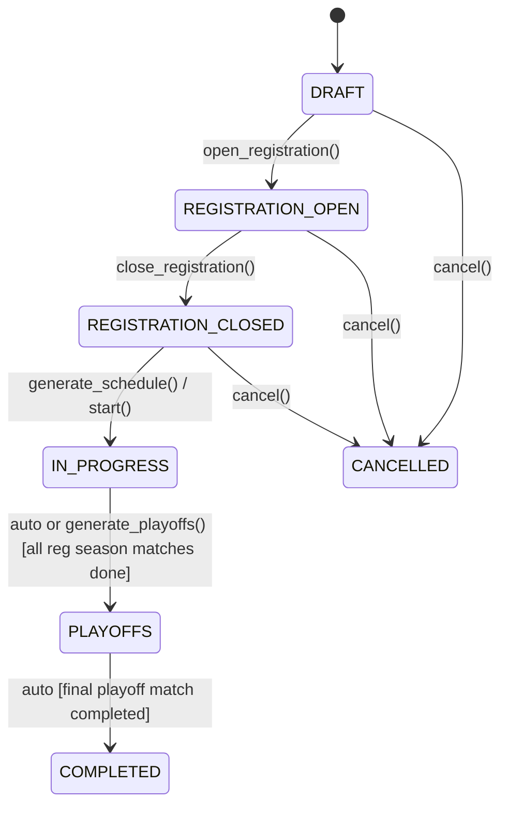

# Phase 9 — League Competition Engine

## Overview

Phase 9 implements the **League Competition Engine** for Aught2 Pickleball.

A **League** represents a multi-week scheduled competition domain separate from standard single-event tournaments.
Leagues feature fixed teams (doubles by default), weekly scheduled match play across regular season weeks, cumulative standings tracking with preserved weekly snapshots, and an automatic transition to championship single-elimination playoffs in the final week.

---

## Architectural Invariants & Decisions

### 1. League is NOT a Tournament Format
- Existing tournament formats remain strictly: `round_robin`, `pool_play`, `scramble`, `bracket`.
- `League` is a separate top-level domain model (`backend/app/models/league.py`).
- Existing tournament routes, endpoints, tables, and logic remain unmodified.

### 2. Full BracketEngine Reuse
- For Week $N$ Championship Playoffs, the system reuses `BracketEngine` (`backend/app/services/competition/bracket_engine.py`).
- No duplicate bracket algorithms were created.
- Seeds are deterministically assigned to qualifying teams directly based on regular-season standings rank (Seed 1 = Rank 1, Seed 2 = Rank 2, etc.).

### 3. Regular Season Result Locking
- Once the championship playoff bracket is generated (or once the league enters `PLAYOFFS` status), all regular-season match scores become **strictly immutable**.
- Attempting to record or correct a regular-season score while the league is in `PLAYOFFS` or `COMPLETED` returns an `HTTP 400 Bad Request`.
- This ensures playoff seeds and brackets never become invalid due to retroactively modified regular-season standings.

### 4. Zero Randomness (Strict Determinism)
- Round-robin schedule generation uses the deterministic **Polygon/Circle Method**.
- Odd team counts receive deterministically assigned BYEs; no phantom or fake match records are created in the database.
- Standings ordering and seed assignment use deterministic cascading tiebreakers:
  1. Wins (descending)
  2. Point Differential (descending)
  3. Total Points Scored (descending)
  4. Team Name (case-insensitive alphabetical ascending)
  5. Team ID (`uuid` string ascending)

---

## Domain Model

### League
- `id`: UUID
- `club_id`: UUID (foreign key to `clubs.id`)
- `name`: String
- `description`: Text (optional)
- `status`: Enum (`draft`, `registration_open`, `registration_closed`, `in_progress`, `playoffs`, `completed`, `cancelled`)
- `number_of_weeks`: SmallInteger ($\ge 2$, default 4)
- `current_week`: SmallInteger (default 1)
- `team_size`: SmallInteger (default 2 for doubles)
- `playoff_team_count`: SmallInteger (power of 2: 2, 4, 8, etc., $\le$ number of teams)
- `scoring_rules`: JSON (`{"game_format": "single_game", "target_score": 11, "win_by": 2}`)
- `start_date`: DateTime (optional)
- `champion_team_id`: UUID (foreign key to `teams.id`, nullable until final completed)

### LeagueWeek
- `id`: UUID
- `league_id`: UUID (foreign key to `leagues.id`)
- `week_number`: SmallInteger (1 to $N$)
- `week_type`: Enum (`regular_season`, `playoffs`)
  - Weeks $1 \dots N-1$: `REGULAR_SEASON`
  - Week $N$: `PLAYOFFS`
- `status`: Enum (`pending`, `in_progress`, `completed`)

### LeagueWeeklyStanding
- `id`: UUID
- `league_id`: UUID
- `league_week_id`: UUID
- `week_number`: SmallInteger
- `team_id`: UUID
- `rank`: SmallInteger
- `matches_played`: Integer
- `wins`: Integer
- `losses`: Integer
- `points_scored`: Integer
- `points_allowed`: Integer
- `points_differential`: Integer

### Match Scoping
`Match` and `Team` models support nullable `tournament_id` and have added `league_id` and `league_week_id`.
Matches in a league have `stage`:
- `MatchStage.REGULAR_SEASON` for regular season weekly rounds
- `MatchStage.PLAYOFFS` for the single-elimination championship bracket

---

## Lifecycle State Machine

1. **DRAFT**: League created by Club Staff. Teams can be pre-registered or roster configured.
2. **REGISTRATION_OPEN**: Player registration is open.
3. **REGISTRATION_CLOSED**: Rosters finalized.
4. **IN_PROGRESS**: Regular season schedule generated. Matches played week-by-week. Standings updated in real time. Snapshots recorded per week.
5. **PLAYOFFS**: Regular season complete. Playoff teams seeded 1..K. Single-elimination bracket generated via `BracketEngine`.
6. **COMPLETED**: Playoff championship final completed. Champion team crowned and recorded on `League.champion_team_id`.

---

## API Endpoints

### Club Staff Endpoints (`/api/v1/clubs/{club_id}/leagues`)

All endpoints require club staff authorization (`OWNER`, `MANAGER`, or `DIRECTOR` where applicable).

| Method | Endpoint | Permission | Description |
|---|---|---|---|
| `POST` | `/` | `MANAGE_TOURNAMENTS` | Create a new league |
| `GET` | `/` | `VIEW_TOURNAMENTS` | List all club leagues |
| `GET` | `/{league_id}` | `VIEW_TOURNAMENTS` | Get league details |
| `PATCH` | `/{league_id}` | `MANAGE_TOURNAMENTS` | Update league settings |
| `POST` | `/{league_id}/status` | `MANAGE_TOURNAMENTS` | Transition league status |
| `POST` | `/{league_id}/teams` | `MANAGE_TOURNAMENTS` | Create fixed team with members |
| `GET` | `/{league_id}/teams` | `VIEW_TOURNAMENTS` | List league teams |
| `POST` | `/{league_id}/schedule` | `MANAGE_TOURNAMENTS` | Generate regular season schedule |
| `GET` | `/{league_id}/weeks` | `VIEW_TOURNAMENTS` | List league weeks |
| `GET` | `/{league_id}/matches` | `VIEW_TOURNAMENTS` | List league matches (filter by week/stage) |
| `POST` | `/{league_id}/matches/{match_id}/score` | `MANAGE_SCORES` | Record a match score (11 win-by-2) |
| `PATCH` | `/{league_id}/matches/{match_id}/score` | `MANAGE_SCORES` | Correct match score (locked in playoffs) |
| `POST` | `/{league_id}/weeks/{week_id}/snapshot` | `MANAGE_TOURNAMENTS` | Manually snapshot weekly standings |
| `GET` | `/{league_id}/standings` | `VIEW_TOURNAMENTS` | Get cumulative regular season standings |
| `GET` | `/{league_id}/snapshots` | `VIEW_TOURNAMENTS` | Get historical weekly snapshots |
| `POST` | `/{league_id}/playoffs/generate` | `MANAGE_TOURNAMENTS` | Generate championship playoff bracket |
| `GET` | `/{league_id}/playoffs` | `VIEW_TOURNAMENTS` | Get playoff bracket summary |

### Player Endpoints (`/api/v1/leagues`)

Authenticated players have read-only access to published leagues.

| Method | Endpoint | Description |
|---|---|---|
| `GET` | `/` | List all active/published leagues |
| `GET` | `/{league_id}` | Get league summary and current status |
| `GET` | `/{league_id}/standings` | View regular season standings table |
| `GET` | `/{league_id}/snapshots` | View weekly standings snapshots |
| `GET` | `/{league_id}/weeks` | View weekly schedule and matches |
| `GET` | `/{league_id}/playoffs` | View championship playoff bracket |

---

## Scoring Rules & Validation

Standard pickleball scoring:
- Target score: `11` (configurable via `scoring_rules`)
- Win by: `2` (e.g. 11-9 is valid, 11-10 is invalid, 12-10 is valid)
- No ties permitted: one team must reach target score and win by margin.
- Winner is automatically derived and persisted to `Match.winner_team_id`.
- For regular season: updates cumulative team records (wins, losses, points scored, points allowed, point differential).
- For playoffs: advances the winning team into the next round match slot and crowns the champion upon completion of the final match.
