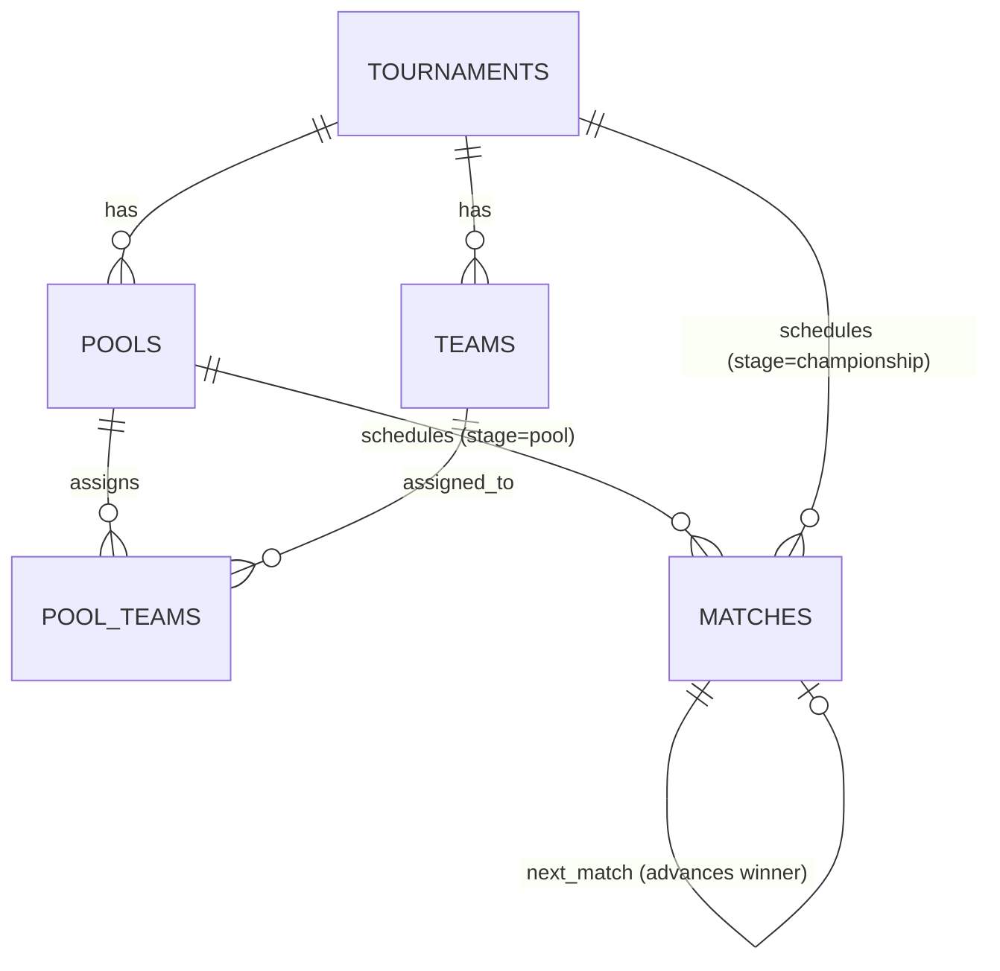

# Aught2 Pickleball — Pool Play Competition Engine (Phase 6)

## Overview

Phase 6 introduces the second complete competition engine in Aught2 Pickleball: the **Pool Play Competition Engine**. It supports multi-stage tournaments where registered teams are distributed into pools, play isolated round-robin matches within each pool, and top qualifiers from each pool advance to a single-elimination Championship Bracket.

Format identifier: `format = "pool_play"`  
Format display label: `"Pool Play"`

---

## 1. Domain Entities & Architecture

### Models

1. **`Pool`** (`pools` table):
   - Belongs to a single `Tournament`.
   - Attributes: `name` (string, e.g. "Pool A", "Pool B"), `pool_order` (integer 1-indexed), `created_at`.
   - Uniqueness: `(tournament_id, name)` and `(tournament_id, pool_order)`.

2. **`PoolTeam`** (`pool_teams` table):
   - Many-to-many relationship assigning a `Team` to a `Pool`.
   - Attributes: `pool_id`, `team_id`, `seed_in_pool` (optional integer), `created_at`.
   - Constraints:
     - `uq_tournament_team_pool`: A team can belong to at most one pool in a tournament.
     - `uq_pool_team`: A team cannot be duplicated in the same pool.

3. **`Match`** (`matches` table) — Extended:
   - `stage`: `MatchStage` enum (`pool`, `championship`).
   - `pool_id`: Nullable UUID foreign key to `pools.id` (required when `stage = 'pool'`).
   - `bracket_round`: Nullable integer (1 = first round, 2 = quarters/semis, etc.).
   - `bracket_position`: Nullable integer (1-indexed position within the round).
   - `next_match_id`: Nullable UUID foreign key to another `Match` for winner advancement.
   - `next_match_slot`: Nullable integer (`1` for `team_a`, `2` for `team_b`).
   - `team_a_id`, `team_b_id`: Nullable foreign keys (supports TBD slots and BYE matchups).

---

## 2. Pool Configuration & Balancing

Tournament directors configure pools via `POST /pools/configure`:
- Number of pools $P \ge 2$.
- Qualifiers per pool $Q \ge 1$.
- Total confirmed teams $T \ge P \times 2$.
- Maximum pool size differential rule: $\lfloor T / P \rfloor$ and $\lceil T / P \rceil$ (difference between largest and smallest pool $\le 1$).
- Qualification bound: $Q \le \min(\text{pool sizes})$.
- Re-configuration guard: Allowed only when zero pool matches have been played (`status = 'completed'`).

---

## 3. Team Assignment Algorithms

### Serpentine (Snake) Seeding (Deterministic)
Teams ordered by seed (or deterministic fallback: registration time, team name) are placed in alternating snake order:
- Round 1: Pool 1 $\to$ Pool 2 $\to$ ... $\to$ Pool $P$
- Round 2: Pool $P$ $\to$ Pool $P-1$ $\to$ ... $\to$ Pool 1
- Round 3: Pool 1 $\to$ Pool 2 $\to$ ... $\to$ Pool $P$
- Guaranteed zero randomness (`random.shuffle()` is strictly prohibited).

### Manual Assignment
Staff can explicitly map teams to pools via `POST /pools/manual-assign`.
- Validates all teams belong to the tournament.
- Validates every pool receives at least 2 teams.
- Validates pool balance rule: $\max(\text{size}) - \min(\text{size}) \le 1$.

---

## 4. Pool Stage Round Robin Scheduling

- `POST /pools/generate-matches` schedules round-robin games within each pool independently.
- Uses Polygon/Circle rotation algorithm per pool.
- Each match is tagged with `stage = "pool"` and `pool_id`.
- Advancing from `registration_closed` to `in_progress` on first generation.
- Schedule regeneration allowed only if **zero matches in any pool have completed scores**.

---

## 5. Pool Standings & Qualification

- Computed independently for each pool.
- Tiebreaker sequence:
  1. **Wins** (descending)
  2. **Points Differential** (descending)
  3. **Points Scored** (descending)
  4. **Team Name** (lexicographic ascending)
- Top $Q$ teams in each pool have `is_qualified = True`.

---

## 6. Championship Single-Elimination Bracket

### Qualification & Seeding
- Total qualifiers $K = P \times Q$.
- Seeding order: Rank 1 finishers seeded 1 to $P$ across pools (ordered by pool wins $\to$ diff $\to$ points $\to$ name).
- Rank 2 finishers seeded $P+1$ to $2P$, etc.

### Standard Bracket Pairings
- Bracket size $S = 2^{\lceil \log_2(K) \rceil}$ ($S \in \{2, 4, 8, 16, 32\}$).
- Standard seed pairings:
  - 2-team bracket: 1 vs 2
  - 4-team bracket: 1 vs 4, 2 vs 3
  - 8-team bracket: 1 vs 8, 4 vs 5, 2 vs 7, 3 vs 6
  - 16-team bracket: 1 vs 16, 8 vs 9, 4 vs 13, 5 vs 12, 2 vs 15, 7 vs 10, 3 vs 14, 6 vs 11
- BYEs: When $K < S$, top seeds receive first-round BYEs and automatically advance to round 2.

### Progression & Completion
- Recording a score in a championship match automatically advances the winner to `next_match_id` at `next_match_slot`.
- When the final match (`next_match_id is None`) is completed:
  - Tournament status automatically transitions to `completed`.

---

## 7. API Endpoints Reference

### Club Staff Operations
- `GET /api/v1/clubs/{club_id}/tournaments/{tournament_id}/pools`: List pools & teams
- `POST /api/v1/clubs/{club_id}/tournaments/{tournament_id}/pools/configure`: Configure pool count & qualifiers
- `POST /api/v1/clubs/{club_id}/tournaments/{tournament_id}/pools/assign-serpentine`: Auto-assign teams snake order
- `POST /api/v1/clubs/{club_id}/tournaments/{tournament_id}/pools/manual-assign`: Manual pool assignment
- `POST /api/v1/clubs/{club_id}/tournaments/{tournament_id}/pools/generate-matches`: Generate pool round robin
- `POST /api/v1/clubs/{club_id}/tournaments/{tournament_id}/pools/regenerate-matches`: Regenerate pool matches
- `GET /api/v1/clubs/{club_id}/tournaments/{tournament_id}/pools/matches`: List pool matches (optional `pool_id` filter)
- `GET /api/v1/clubs/{club_id}/tournaments/{tournament_id}/pools/standings`: All pools live standings
- `POST /api/v1/clubs/{club_id}/tournaments/{tournament_id}/championship/generate`: Generate championship bracket
- `GET /api/v1/clubs/{club_id}/tournaments/{tournament_id}/championship/matches`: List championship matches

### Player Read-Only Operations
- `GET /api/v1/tournaments/{tournament_id}/pools`: View pools
- `GET /api/v1/tournaments/{tournament_id}/pools/matches`: View pool matches
- `GET /api/v1/tournaments/{tournament_id}/pools/standings`: View pool standings
- `GET /api/v1/tournaments/{tournament_id}/championship/matches`: View championship bracket
