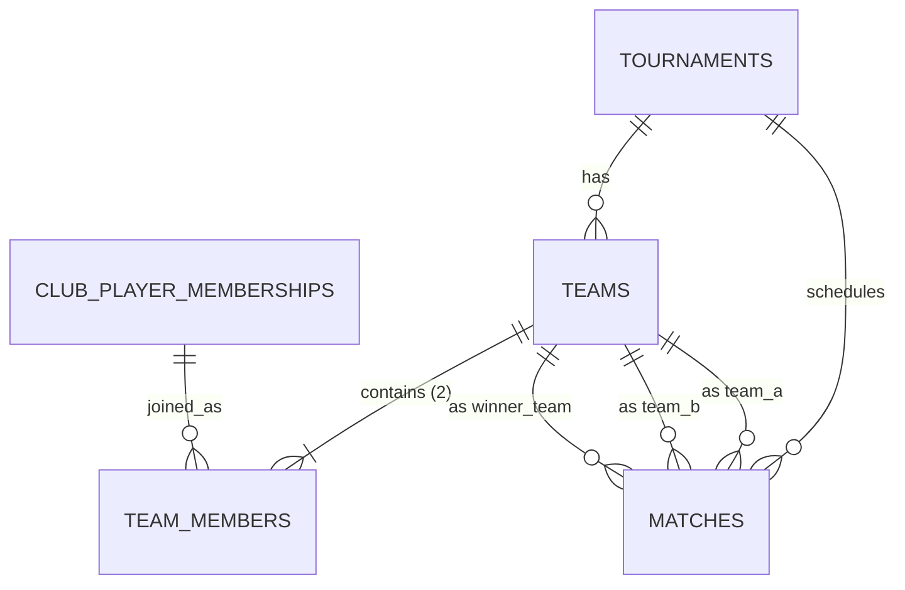

# Aught2 Pickleball — Round Robin Competition Engine (Phase 5)

## Overview

Phase 5 introduces the first fully playable tournament format in Aught2 Pickleball: the **Round Robin Competition Engine**. Built on top of the Phase 1–4 foundations, it enables club staff to form fixed-partner teams, generate deterministic round-robin schedules, record and correct official match scores, and compute live division standings with full tiebreaker support.

Generic database models (`Team`, `TeamMember`, `Match`) ensure long-term architectural reusability across future formats (Pool Play, Scramble, Bracket), while format-specific logic is encapsulated in `RoundRobinEngine` and `ScoreValidator`.

---

## 1. Domain Entities & Architecture

### Models

1. **`Team`** (`teams` table):
   - Belongs to a single `Tournament`.
   - Attributes: `name` (string), `seed` (optional integer), `created_at`, `updated_at`.
   - Associated members via `TeamMember`.

2. **`TeamMember`** (`team_members` table):
   - Associative entity linking `Team` to `ClubPlayerMembership`.
   - Enforces unique constraint: a player cannot belong to multiple teams in the same tournament (`uq_tournament_player`).
   - Round Robin requires **exactly 2 members** per team (doubles partner format).

3. **`Match`** (`matches` table):
   - Generic match entity: `tournament_id`, `round_number`, `match_number`, `team_a_id`, `team_b_id`.
   - Status: `pending`, `completed`, `cancelled`.
   - Results: `score_a`, `score_b`, `winner_team_id`, `completed_at`.
   - Winner is **derived server-side** — client never inputs the winner.

---

## 2. Schedule Generation (Circle Algorithm)

The Round Robin schedule is generated deterministically using the standard **Circle / Polygon Rotation Algorithm**:

1. **Team Alignment**:
   - If team count $N$ is even: Round count is $N - 1$. Matches per round is $N / 2$. Total matches is $N(N - 1) / 2$.
   - If team count $N$ is odd: A virtual "bye" is introduced ($N + 1$). Round count is $N$. Matches per round is $(N - 1) / 2$. Total matches is $N(N - 1) / 2$. Any match paired with the bye is omitted from DB persistence.
2. **Deterministic Pairings**:
   - One team is anchored at position 0; all other teams rotate clockwise around the polygon each round.
   - Generates every unique pairwise matchup exactly once.
3. **Lifecycle Transition**:
   - Generating matches automatically advances tournament status from `registration_closed` to `in_progress`.
4. **Regeneration Guard**:
   - Schedule can be regenerated only if **zero matches have completed scores**.
   - Once any score is recorded, regeneration and team modifications are strictly rejected (`400 Bad Request`).

---

## 3. Score Validation & Recording

Official pickleball scoring rules are strictly enforced by `ScoreValidator`:

- Both scores must be non-negative integers.
- Scores cannot be tied ($score_A \neq score_B$).
- The winning team must score at least the target score (default: **11**).
- The winning team must win by at least the margin requirement (default: **2** points).
- Examples:
  - `11 - 7` (Valid standard win)
  - `11 - 0` (Valid shutout)
  - `13 - 11` (Valid overtime win)
  - `10 - 8` (Invalid: winner below 11)
  - `11 - 10` (Invalid: margin < 2)
  - `11 - 11` (Invalid: tie)
- Winner determination:
  - If $score_A > score_B \implies$ `winner_team_id = team_a_id`
  - If $score_B > score_A \implies$ `winner_team_id = team_b_id`
- Score correction:
  - An already-completed match can have its score updated via `PATCH /matches/{match_id}/result`.
  - Corrections trigger immediate live standings recalculation.

---

## 4. Standings & Tiebreaker Rules

Standings are calculated dynamically from completed matches (not persisted in a separate table, guaranteeing real-time consistency without drift).

### Tiebreaker Hierarchy (in exact evaluation order):

1. **Wins** (descending)
2. **Points Differential** ($Points Scored - Points Allowed$, descending)
3. **Total Points Scored** (descending)
4. **Team Name** (lexicographic ascending, case-insensitive deterministic fallback)

Each standing row contains:
- `rank`: Integer rank (1, 2, 3...)
- `team_id`, `team_name`, `team_seed`
- `wins`, `losses`, `matches_played`
- `points_scored`, `points_allowed`, `points_differential`

---

## 5. API Endpoints Reference

### Club Staff Management (Authorized)
Requires `club_owner`, `club_manager`, or `tournament_director` role in active club:

| Method | Path | Description |
|---|---|---|
| `GET` | `/api/v1/clubs/{club_id}/tournaments/{id}/teams` | List teams and members |
| `POST` | `/api/v1/clubs/{club_id}/tournaments/{id}/teams` | Create 2-player team |
| `PATCH` | `/api/v1/clubs/{club_id}/tournaments/{id}/teams/{team_id}` | Update team name/seed/members |
| `DELETE` | `/api/v1/clubs/{club_id}/tournaments/{id}/teams/{team_id}` | Delete team (pre-generation only) |
| `POST` | `/api/v1/clubs/{club_id}/tournaments/{id}/generate-round-robin` | Generate round-robin schedule |
| `POST` | `/api/v1/clubs/{club_id}/tournaments/{id}/regenerate-round-robin` | Clear pending & regenerate schedule |
| `GET` | `/api/v1/clubs/{club_id}/tournaments/{id}/matches` | List matches by round |
| `GET` | `/api/v1/clubs/{club_id}/tournaments/{id}/matches/{match_id}` | Get match details |
| `POST` | `/api/v1/clubs/{club_id}/tournaments/{id}/matches/{match_id}/result` | Record match score |
| `PATCH` | `/api/v1/clubs/{club_id}/tournaments/{id}/matches/{match_id}/result` | Correct recorded score |
| `GET` | `/api/v1/clubs/{club_id}/tournaments/{id}/standings` | Get calculated standings |

### Player Read-Only (Authenticated)
Any authenticated user:

| Method | Path | Description |
|---|---|---|
| `GET` | `/api/v1/tournaments/{id}/teams` | View tournament teams |
| `GET` | `/api/v1/tournaments/{id}/matches` | View tournament schedule & scores |
| `GET` | `/api/v1/tournaments/{id}/standings` | View tournament division standings |

---

## 6. Security & Tenant Isolation

- All write operations require club staff permissions validated against `club_memberships`.
- All team, match, and standings queries verify tournament tenant ownership (`tournament.club_id == club_id`).
- Cross-club team creation or cross-tournament player assignments are rejected.
- Direct object reference attacks on `team_id` or `match_id` across clubs return `404 Not Found`.
