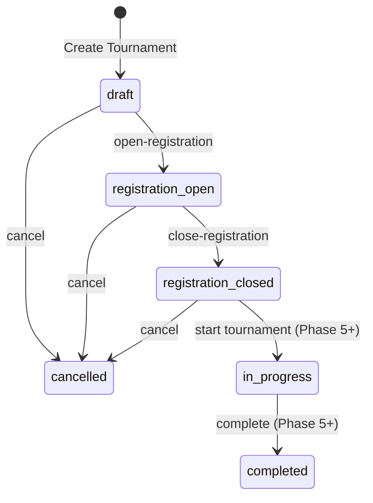

# Aught2 Pickleball — Tournament Foundation (Phase 4)

## Overview

The Tournament Foundation provides a robust, generic competition model designed to support multiple tournament formats while strictly maintaining club tenant isolation, deterministic scoring, lifecycle state machines, and player eligibility.

> **Scope Note**: Phase 4 implements the tournament entity, participant registrations, lifecycle state transitions, and discovery. Full match generation, bracket trees, pool standings engines, and live scoring will be added in subsequent phases.

---

## 1. Supported Formats

Aught2 Pickleball explicitly supports **four** competition formats:

| Format Identifier | Display Label | Description |
|-------------------|---------------|-------------|
| `round_robin` | Round Robin | Every participant plays against every other participant in the division. |
| `pool_play` | Pool Play | Participants are divided into pools/groups for preliminary rounds, advancing to knockouts. |
| `scramble` | Scramble | Individual players rotate partners and opponents each round. |
| `bracket` | Single Elimination Bracket | Traditional knockout bracket where losing ends competition. |

---

## 2. Tournament Lifecycle & State Machine



### State Transitions & Rules

1. **`draft`**:
   - Initial state upon creation.
   - Staff can freely edit all fields (name, description, format, dates, capacity, scoring rules).
   - Players cannot self-register while in draft.
2. **`registration_open`**:
   - Transitioned via `POST /clubs/{club_id}/tournaments/{id}/open-registration`.
   - Eligible club player members can self-register.
   - **Structural Configuration Lock**: Format, min participants, and max participants are strictly locked from updates.
3. **`registration_closed`**:
   - Transitioned via `POST /clubs/{club_id}/tournaments/{id}/close-registration`.
   - Self-registration is closed.
   - Format, capacity, scoring rules, and tiebreakers are locked.
4. **`cancelled`**:
   - Transitioned via `POST /clubs/{club_id}/tournaments/{id}/cancel` from `draft`, `registration_open`, or `registration_closed`.
   - Terminal state; cannot be cancelled again or reopened.

---

## 3. Scoring Rules & Tiebreaker Hierarchy

### Deterministic Default Scoring
Every tournament is created with standard scoring rules stored as JSON:

```json
{
  "game_format": "single_game",
  "target_score": 11,
  "win_by": 2
}
```

### Default Tiebreaker Hierarchy
Stored as a deterministic ordered array:
1. `wins` (Match wins)
2. `points_differential` (Total points won minus total points conceded)
3. `total_points_scored` (Raw total points scored across games)
4. `team_name_deterministic` (Deterministic alphabetical fallback)

---

## 4. Participant Registration & Eligibility

### Player Membership Requirement
To register for a tournament:
1. The user must be authenticated.
2. The user must have an **`active` `ClubPlayerMembership`** in the club hosting the tournament.
3. If the tournament reaches `max_participants`, subsequent entrants are marked with status `waitlisted`.

### In-Place Cancellation & Reactivation
- When a player withdraws (`DELETE /tournaments/{id}/register`), their registration row is marked `cancelled` with `cancelled_at` timestamp.
- If the player decides to re-register before registration closes, the existing row is reactivated to `confirmed` (or `waitlisted` if full) in-place, preserving relational integrity and avoiding duplicate key conflicts on `(tournament_id, player_membership_id)`.

---

## 5. Permissions & Authorization

Tournament management uses the centralized `Permission.MANAGE_TOURNAMENTS` check:

| Role | Has `MANAGE_TOURNAMENTS`? | Can Manage Tournaments? |
|------|---------------------------|-------------------------|
| `club_owner` | ✅ Yes | Full management |
| `club_manager` | ✅ Yes | Full management |
| `tournament_director` | ✅ Yes | Competition management |
| Regular Player | ❌ No | Self-registration only |

---

## 6. API Surface

### Club Staff Endpoints
- `GET /api/v1/clubs/{club_id}/tournaments` — List club tournaments (optional `?status=` filter).
- `POST /api/v1/clubs/{club_id}/tournaments` — Create tournament in draft.
- `GET /api/v1/clubs/{club_id}/tournaments/{id}` — Get club tournament details.
- `PATCH /api/v1/clubs/{club_id}/tournaments/{id}` — Update configuration (subject to locking rules).
- `POST /api/v1/clubs/{club_id}/tournaments/{id}/open-registration` — Open registration.
- `POST /api/v1/clubs/{club_id}/tournaments/{id}/close-registration` — Close registration.
- `POST /api/v1/clubs/{club_id}/tournaments/{id}/cancel` — Cancel tournament.
- `GET /api/v1/clubs/{club_id}/tournaments/{id}/registrations` — List registered participants.
- `PATCH /api/v1/clubs/{club_id}/tournaments/{id}/registrations/{reg_id}` — Update participant status/seed.

### Player & Discovery Endpoints
- `GET /api/v1/player/tournaments` — Discover public tournaments across active clubs.
- `GET /api/v1/tournaments/{id}` — View tournament details.
- `POST /api/v1/tournaments/{id}/register` — Self-register caller for open tournament.
- `DELETE /api/v1/tournaments/{id}/register` — Cancel caller's registration.
